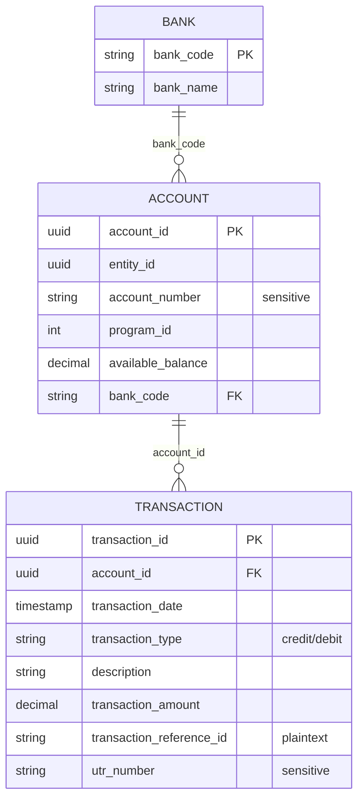

# Finance Assistant — Database Schema

The tables a hackathon team actually needs to build and test a finance assistant against: **3 tables, one database.** No app-internal logging/feedback tables included — those aren't part of what you build or test.

## The simple version

- **`bank`** — a short list of banks (name + code).
- **`account`** — one row per account, belonging to a bank.
- **`transaction`** — one row per credit/debit, belonging to an account.

One bank has many accounts; one account has many transactions. That's the whole [[Database Design]] shape.

## `bank`

| Column | Type | Notes |
|---|---|---|
| `bank_code` | string | **Primary key**, matches IFSC prefix — e.g. `HDFC`, `ICIC`, `SBIN`, `UTIB`, `AUBL` |
| `bank_name` | free text | Canonical, all-caps, formal names — e.g. `HDFC BANK LIMITED`, `AU SMALL FINANCE BANK LIMITED`. Keep a fixed list of valid values so your assistant never invents a bank name that isn't really in the table |

## `account`

| Column | Type | Notes |
|---|---|---|
| `account_id` | UUID (string) | **Primary key** |
| `entity_id` | UUID (string) | The customer/entity that owns this account |
| `account_number` | string | Treat as sensitive — mask or encrypt it, don't show it raw in answers |
| `program_id` | integer | e.g. `21`, `04`, `46` — which product/program the account belongs to |
| `available_balance` | decimal | e.g. `91993.88` |
| `bank_code` | string | Foreign key → `bank.bank_code` |

## `transaction`

| Column | Type | Notes |
|---|---|---|
| `transaction_id` | UUID (string) | Primary key |
| `account_id` | UUID (string) | Foreign key → `account.account_id` |
| `transaction_date` | timestamp | `YYYY-MM-DD HH:MM:SS.ssssss` |
| `transaction_type` | string (enum) | `'credit'` or `'debit'` only |
| `description` | free text | e.g. "IMPS charges", "Cheque Deposits" |
| `transaction_amount` | decimal | e.g. `91993.88` |
| `transaction_reference_id` | string (varchar 64) | Plaintext, directly searchable — a reference/receipt number |
| `utr_number` | string (varchar 256) | Treat as sensitive like `account_number` — if you encrypt it, remember an encrypted column can't be searched with a plain `WHERE =`; you'd need to decrypt rows first |

> **Why two "reference" columns?** Users will say "ref no" for both, but they're not interchangeable if one is plaintext and one is sensitive/encrypted. Decide up front which column a bare "reference number" question should hit, and only fall back to the other one if the user is explicit (e.g. says "UTR"). This [[Encryption]] decision affects your [[SQL Query Generation]] logic.

## DDL — `CREATE TABLE`

```sql
CREATE TABLE bank (
    bank_code    VARCHAR(10)  PRIMARY KEY,
    bank_name    VARCHAR(150) NOT NULL
) ENGINE=InnoDB DEFAULT CHARSET=utf8mb4;

CREATE TABLE account (
    account_id         VARCHAR(36)  PRIMARY KEY,
    entity_id          VARCHAR(36)  NOT NULL,
    account_number     VARCHAR(20)  NOT NULL,
    program_id         INT          NOT NULL,
    available_balance  DECIMAL(15,2) NOT NULL DEFAULT 0.00,
    bank_code          VARCHAR(10)  NOT NULL,
    FOREIGN KEY (bank_code) REFERENCES bank(bank_code)
) ENGINE=InnoDB DEFAULT CHARSET=utf8mb4;

CREATE TABLE transaction (
    transaction_id           VARCHAR(36)  PRIMARY KEY,
    account_id               VARCHAR(36)  NOT NULL,
    transaction_date         TIMESTAMP(6) NOT NULL,
    transaction_type         ENUM('credit','debit') NOT NULL,
    description              VARCHAR(500) DEFAULT NULL,
    transaction_amount       DECIMAL(15,2) NOT NULL DEFAULT 0.00,
    transaction_reference_id VARCHAR(64)  DEFAULT NULL,
    utr_number               VARCHAR(256) DEFAULT NULL,
    FOREIGN KEY (account_id) REFERENCES account(account_id)
) ENGINE=InnoDB DEFAULT CHARSET=utf8mb4;
```

## Sample data (10 rows each)

Based on real patterns from the production export — same bank IFSC prefixes, same business-name conventions (`SELECTION ELECTRONICS`, `SELECTRICITY TWO PRIVATE LIMITED`), same Bajaj Finance disbursement format, same running-balance style.

### `bank`

```sql
INSERT INTO bank (bank_code, bank_name) VALUES
('HDFC', 'HDFC BANK LIMITED'),
('ICIC', 'ICICI BANK LIMITED'),
('SBIN', 'STATE BANK OF INDIA'),
('UTIB', 'AXIS BANK LIMITED'),
('KKBK', 'KOTAK MAHINDRA BANK LIMITED'),
('CNRB', 'CANARA BANK'),
('UBIN', 'UNION BANK OF INDIA'),
('AUBL', 'AU SMALL FINANCE BANK LIMITED'),
('TMBL', 'TAMILNAD MERCANTILE BANK LIMITED'),
('RATN', 'RBL BANK LIMITED');
```

### `account`

```sql
INSERT INTO account (account_id, entity_id, account_number, program_id, available_balance, bank_code) VALUES
('acfbe204-7541-492c-a352-040aa984bedc', 'f2f5e332-c2d1-4555-9a6b-65c7cd195077', '50200013729069', 21, -25907487.00,  'HDFC'),
('6f306737-dfa8-4bf7-8003-be64034b8dea', '2d52dda2-d98a-4381-af80-45bdb173860c', '50200099284137', 21, -94766029.00,  'HDFC'),
('bfbfe347-11d6-48d7-acff-4f091f59d34b', 'e767c3c1-3a0d-43b5-b2ff-06f49bdf3de2', '39208809622308', 04,  40842693.08,  'UBIN'),
('212239b5-63d9-4da6-aa8c-46485e0f8a42', 'ac1a0654-461b-4216-95d1-bbcb9ab6da4e', '30123456789012', 46,    109283.80,  'SBIN'),
('34448e78-c3fe-4b5d-be8c-a45a6349b8d4', 'e984c75d-aad6-4655-823a-4e9e06a869bc', '40100556677889', 21, 231680596.77,  'UTIB'),
('5cecd2c2-f075-4bbd-a08b-b156ca48dc7e', 'e0000005-0000-0000-0000-000000000005', '60100112233445', 04, -131629423.33, 'HDFC'),
('e767c3c1-3a0d-43b5-b2ff-06f49bdf3de2', '00000006-0000-0000-0000-000000000006', '70100334455667', 21,   8695000.75,  'KKBK'),
('2d52dda2-d98a-4381-af80-45bdb173860c', '00000007-0000-0000-0000-000000000007', '80100123456789', 46,   3887946.81,  'CNRB'),
('ac1a0654-461b-4216-95d1-bbcb9ab6da4e', '00000008-0000-0000-0000-000000000008', '90100987654321', 21,   3278516.63,  'SBIN'),
('e984c75d-aad6-4655-823a-4e9e06a869bc', '00000009-0000-0000-0000-000000000009', '20100556677889', 46,  -117420771.35,'ICIC');
```

### `transaction`

```sql
INSERT INTO transaction (transaction_id, account_id, transaction_date, transaction_type, description, transaction_amount, transaction_reference_id, utr_number) VALUES
('001cb576-eb28-44b1-a219-0f3f27093fad', 'acfbe204-7541-492c-a352-040aa984bedc', '2026-06-24 18:24:06.000000', 'debit',  'FT -  95842568 -  50200013729069 - SELECTION ELECTRONICS   DAHISAR EAST',  14866.00,  '1715499972', 'jhI5nAdyb1qOEjmcB3JvWjC6tTO+ZPVqBFPm/GiErC4TRBWRQ5ylPG3p'),
('0021433a-8d92-40e9-b811-5ba994747975', '6f306737-dfa8-4bf7-8003-be64034b8dea', '2026-05-14 11:31:37.000000', 'debit',  'UPI-NAVYUG SELECTION-XXXXXX8672-AUBL0002125-103293775381-260514201735136',      50000.00,  '103293775381','jhI5nAdyb1qOEjmcB3JvWjC9tzSzbvtkBlK+NSqsiL164ZK8Bl8cYg8y1l8='),
('00baf475-8710-4d17-b626-d25fc311eb7f', '5cecd2c2-f075-4bbd-a08b-b156ca48dc7e', '2025-12-16 18:13:34.000000', 'credit', 'R/RATNR52025121600100235/ZBFLCTP405PBL15667333//SELECTRICITY TWO PRIVATE LIMITED/RATNR52025121600100235 /SELECTRICITY TWO PRIVATE LIMITED', 260000.00, 'S31125841', NULL),
('014b7179-e696-4837-9b8e-7164d171b760', 'acfbe204-7541-492c-a352-040aa984bedc', '2026-06-24 06:39:10.000000', 'debit',  'NEFT  - UTIB0002678 - 95604250 - 915020031685136 - UMANG SELECTIONHAPURBPES DPF10129', 7959.00, 'HDFCH01078329532', 'jhI5nAdyb1qOEjmcB3JvWknJwkXCbf1jBFm1NhmQqR0EoF/PNGRDCa1+UTH2I/tV'),
('000000ac-39c5-4eb3-9fe3-ed40ceecee5d', 'e984c75d-aad6-4655-823a-4e9e06a869bc', '2025-12-03 16:24:54.000000', 'debit',  'NEFT/000483399203/ICIC/PARESH VIKRANT GHASE',                                               9241.00,  'S5314253',  NULL),
('04818df6-e726-4405-a8e3-4f6c15caa956', 'e767c3c1-3a0d-43b5-b2ff-06f49bdf3de2', '2026-01-02 09:58:41.000000', 'credit', 'IMPS/P2A/600228462725/UTIB/918020101986700/00/INET/9211/SELECTIONMALIGAI/ZBFLCTP5L2PBL11476675/INWD48', 36810.00, 'S69244711', NULL),
('0178b656-4a7d-98e8-9540f6e24caf', 'ac1a0654-461b-4216-95d1-bbcb9ab6da4e', '2026-03-17 14:53:45.000000', 'debit',  'IMPS OW/507614422198/Gautam singh/SBIN/43292707719',                                          110.00,   NULL,       NULL),
('0266384b-929c-478d-a7da-a54acf984343', 'acfbe204-7541-492c-a352-040aa984bedc', '2026-06-24 06:30:27.000000', 'debit',  'NEFT  - ICIC0001241 - 95584112 - 124105002702 - SELECTION MOBILE',                             66899.00,  'HDFCH01078324740', 'jhI5nAdyb1qOEjmcB3JvWknJwkXCbf1jBFm1NhSSrh+QRpxgqe0VEdKaiI24S8Up'),
('02c96198-4397-4160-b5ce-607f6696f581', 'acfbe204-7541-492c-a352-040aa984bedc', '2026-06-24 06:56:01.000000', 'debit',  'NEFT  - ICIC0001241 - 95600270 - 124105002702 - SELECTION MOBILE',                             79575.00,  'HDFCH01078342174', 'jhI5nAdyb1qOEjmcB3JvWknJwkXCbf1jBFm1MBKUrRvYyGUaTtHlT1wi23x31CRl'),
('038969bd-5941-4d13-ba9f-dda911cc0b4e', '6f306737-dfa8-4bf7-8003-be64034b8dea', '2026-05-20 09:49:02.000000', 'debit',  'FT-RERELI2010000810-RELIANCEDIGITAL RETAIL LTD   SELECT CITY SAKET DELHI',                     21156.00,  '1643797818', 'jhI5nAdyb1qOEjmcB3JvWjC7sDW9ZPtrAllbY+gS/wWLLijTRu8nX6op');
```

## ER diagram



