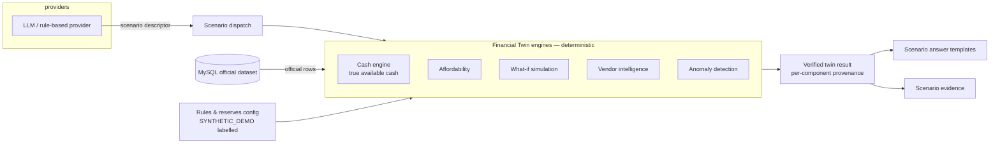
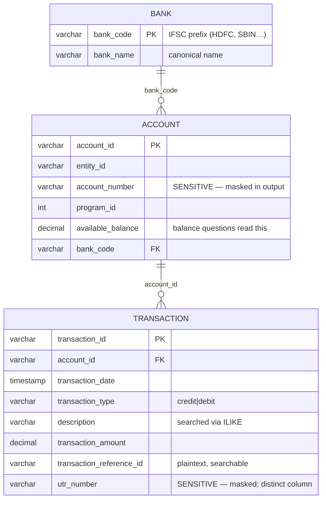

# Artha — System Architecture

> This document describes the architecture **as it actually exists** in the
> repository (post Financial-Twin pass). Future/possible components are
> confined to §14 and are explicitly labelled.

## 1. Overview

Artha is a grounded finance assistant over the TBX dataset (`bank` →
`account` → `transaction`). A user asks questions in natural language
through a React chat UI; a lightweight LLM (or a deterministic rule-based
fallback) maps the question to a **structured Finance Query** — or, for
twin scenarios, a **structured scenario descriptor**; that draft is
validated, compiled to a parameterized SELECT (or executed by a
deterministic twin engine), and the computed result is rendered into an
answer by deterministic templates alongside a verifiable evidence block
("How I got this" + masked source records + provenance labels).

Core principle, enforced structurally (not by prompt discipline):

> **AI understands the question; deterministic systems establish financial
> truth.**

The LLM has no database access, no SQL output path, and no numeric output
path — every rupee figure in an answer was returned by SQL or by a
deterministic twin engine first.

## 2. Architecture diagram

```mermaid
flowchart TD
    U[User] --> UI[React Chat UI<br/>answer · evidence · confidence<br/>+ Financial Twin sidebar]

    UI -- POST /api/chat --> API[FastAPI Backend]
    UI -- GET /api/twin/* --> TW[Financial Twin engines]

    API --> C[Conversation Manager<br/>structured context:<br/>intent · metric · type · bank · range]

    C --> Q[Query Understanding]
    Q --> LLM[Lightweight LLM<br/>claude-haiku-4-5<br/>structured outputs]
    Q --> RB[Rule-based Fallback<br/>deterministic regex]

    Q -- twin question --> SD[Scenario Descriptor<br/>affordability · what_if · cash_position<br/>vendor_profiles · anomalies]
    LLM -- draft query JSON --> FQ[Structured Finance Query]
    RB -- draft query JSON --> FQ

    FQ --> V[Pydantic Validation<br/>closed enums · extra=forbid<br/>coherence checks]
    V -- reject --> REF[Structured Refusal<br/>unsupported / ambiguous / invalid]
    SD --> SC[Scenario Dispatch<br/>validated against known scenarios]
    V --> G[Grounding / Schema Guardrails<br/>SQL-token screening<br/>server-side date resolution]

    G --> QE[Deterministic Query Engine<br/>FinancialQuery → compiled SELECT<br/>parameter-bound]
    QE --> DB[(MySQL<br/>bank · account · transaction<br/>read-only session)]
    DB -- masked rows --> R[Verified Financial Result<br/>QueryResult — the grounding contract]

    SC --> TE[Financial Twin Engines<br/>cash · affordability · simulation<br/>vendor intel · anomaly]
    TE -- official rows + labelled config --> TR[Verified Twin Result<br/>every component provenance-tagged]

    R --> E[Evidence Builder<br/>how_calculated · breakdown · records ≤15]
    R --> A[Controlled Answer Generator<br/>templates only · no DB · no LLM]
    TR --> E2[Scenario Evidence<br/>operation SCENARIO(·) · scenario_result]
    TR --> A2[Scenario Answer Templates<br/>deterministic · no LLM]

    E --> OUT[Answer + Breakdown + Evidence<br/>status · confidence + basis]
    A --> OUT
    E2 --> OUT
    A2 --> OUT
    REF --> OUT

    OUT -- JSON --> UI
    UI -- export rows verbatim --> X[POST /api/export/evidence<br/>CSV / Excel]
```

## 3. Request lifecycle

Example request: **"How much did we spend on vendor payouts last month?"**

1. The UI `POST`s `{question, conversation_id}` to `/api/chat`.
2. The conversation manager fetches the **structured context** for that id
   (last intent/metric/type/bank/date-range/filters — never a transcript).
3. The active provider (LLM or rule-based) reads the question + context and
   returns a *draft* structured query. Here it recognizes `vendor` as an
   **unsupported domain** and returns a refusal — no database call is made.
   (For a twin question like "Can I pay X ₹Y?", the provider instead returns
   a **scenario descriptor** — see §5 — and steps 4–7 below are replaced by
   the scenario dispatch path; refusal/unsupported-domain gates never fire
   on those, since the descriptor is validated first.)
4. (For a supported question:) Pydantic validates the draft — closed enums,
   `extra="forbid"`, coherence rules. Invalid drafts → `invalid` refusal.
5. Guardrails resolve dates server-side ("last month" → absolute range on
   the IST clock) and screen filter values for SQL tokens.
6. The deterministic engine compiles the validated query to a single
   parameterized SELECT, executes it in a **read-only** MySQL session, and
   computes the matched-record count pre-limit.
7. MySQL returns rows; the engine masks `account_number`/`utr_number` at
   the boundary and builds the typed `QueryResult`.
8. Aggregates/peaks/comparisons are computed in the engine (comparison =
   second execution against the previous calendar month).
9. The evidence builder turns the result into `how_calculated` (date range,
   operation, records matched, filters) + breakdown + ≤15 masked records.
   Twin scenarios produce a `SCENARIO(·)` operation block carrying the
   verified twin result instead.
10. `generate_answer()` renders the sentence **from the verified result only**
    (Indian digit grouping) — it has no DB session and no LLM.
11. The API responds with `answer`, `evidence`, `query`, `status`,
    `confidence`, `confidence_basis`; the UI displays the three evidence
    zones and offers verbatim CSV/Excel export.

## 4. Grounding architecture

```text
LLM ──draft JSON──▶ validation ──▶ deterministic SQL ──▶ MySQL
                                                        │
        answer ◀── templates ◀── QueryResult ◀──────────┘
                                   (verified, masked)
```

Why hallucination is structurally prevented:

- **No SQL from the model** — the "text-to-SQL" compiler consumes only a
  validated `FinancialQuery`; sqlglot asserts a single SELECT with no
  DML/DDL nodes; values are bound parameters.
- **No numbers from the model** — answers render exclusively from
  `QueryResult`; a tamper test proves the result object is the sole numeric
  source (`tests/test_grounding_contract.py`).
- **No invented fields** — `extra="forbid"` on every schema; unknown intents/
  metrics/filters fail validation *before* execution.
- **No invented domains** — payroll, invoices, taxes, escrow, customers,
  forecasts are refused with the missing domain named. (Vendor aggregates
  are not invented either: they are deterministically derived from
  transaction descriptions by the twin's vendor intelligence, §6.)
- **No raw sensitive values** — masking happens inside the engine; raw
  `account_number`/`utr_number` are absent downstream (one-way masks,
  verified by test).
- **Read-only database** — the chat path runs its MySQL session with
  `SET SESSION TRANSACTION READ ONLY`; no write operations exist anywhere
  in the API.

## 5. Model architecture

- **Why lightweight:** the model performs one constrained extraction task
  over a closed output space; structured outputs + Pydantic validation make
  scale unnecessary for accuracy (full reasoning in
  `docs/model-evaluation.md`).
- **What it does / does not do:** it maps question → draft query JSON; it
  never computes, retrieves, or restates financial values.
- **Structured output:** the Anthropic provider requests JSON-schema-
  constrained decoding with the *same* enums the validator enforces.
- **Provider abstraction:** `LLMProvider` → `AnthropicProvider` (API) or
  `RuleBasedProvider` (deterministic fallback; zero tokens; full benchmark
  passes without any API key). New providers (local models, mocks) subclass
  and register in `build_provider()`.
- **Evaluation framework:** 45-case benchmark scoring accuracy (computed),
  latency, token usage, and failure categories per provider/model.

## 6. Financial Twin layer (Financial Intelligence)

The twin is a **structured domain model of the business's finances — not an
LLM**. The LLM contributes only the scenario descriptor (which twin engine
to run, with what arguments); all numbers come from data or labelled
configuration. Full domain model and limitations: `docs/financial-twin.md`.



- **Provenance on every value:** `OFFICIAL_DATASET` (read from loaded data),
  `DERIVED` (computed from official rows), `USER_PREFERENCE` (user-set —
  reserved, none shipped), `SYNTHETIC_DEMO` (demo rules/reserves, labelled
  as such everywhere they surface).
- **True available-cash engine:** `Σ account.available_balance` (official)
  minus protected reserves (demo config) minus restricted/commitments —
  which have **no data source** and are reported as explicit zeros with a
  note, never estimated. No double counting (tested as an arithmetic
  identity on the live engine).
- **Affordability ("Can I pay X ₹Y?"):** deterministic feasibility — cash
  after payment, reserve violation, minimum-buffer violation, approval
  threshold — plus derived vendor history. Analysis only: **no payment is
  ever executed** (tested; no pay endpoint exists).
- **What-if simulation:** static before → payment → after with per-rule
  outcomes (preserved / violated / approval), explicitly labelled
  assumptions.
- **Vendor intelligence:** counterparties parsed from transaction
  descriptions with deterministic format parsers; aggregates computed from
  actual rows (one vendor's total verified against direct SQL in tests).
- **Anomaly detection:** `amount > multiplier × counterparty
  historical_average` (history excludes the transaction; min-history gate).
  Multiplier/min-history configurable via env; no ML, no LLM judgement.
- **Reconciliation:** honest absence — the current dataset has no
  reconciliation table; the API returns `available: false` plus the exact
  adapter interface a future table would satisfy. Nothing is fabricated.
- **Chat integration:** twin questions route through the same chat pipeline
  — the provider emits a validated scenario descriptor, `ChatService`
  executes the engine and renders template answers from the verified result.
  The same grounding contract applies: the model never produces numbers.
- **UI:** chat remains primary; a Financial Twin sidebar (`TwinPanel`)
  surfaces cash position, top vendors, anomaly alerts, and rules/reserves —
  each with provenance badges.

## 7. Data architecture

Physical tables in the MySQL `artha` database (loaded from `data/*.csv`
by `scripts/load_data.py`; seed=42; 10 banks, 25 accounts, 8,000
transactions):



There are **no** vendor / invoice / payroll / reconciliation tables in the
current data model. Questions requiring those *tables* are refused, not
approximated — with one exception: the twin's vendor intelligence derives
counterparty aggregates from the `transaction.description` field itself
(§6), so no vendor table is needed or invented. (The teammate-authored
`dataset/extended_v1/` directory contains such tables for future work — it
is **not** loaded by the application.)

Indexes match actual query patterns: `transaction_date`, `account_id`,
`transaction_type`, `transaction_reference_id`, `account(bank_code)`.

## 8. Security / safety boundaries

| Boundary | Mechanism |
|---|---|
| Schema enforcement | Pydantic closed enums + `extra="forbid"` on query, filters, date range |
| Forbidden fields | unknown filter names rejected (allowlist = real columns only) |
| SQL-token screening | filter values matched against SQL-keyword patterns and rejected |
| Injection | parameterized queries only; sqlglot asserts single SELECT, no DML/DDL |
| Sensitive masking | `account_number` → `XXXXX1234`; UTR → prefix+***+suffix (engine boundary) |
| Arbitrary SQL | none — the only SQL producer is the deterministic compiler |
| Write operations | none; MySQL session forced read-only on the chat path |
| Unsupported queries | explicit refusal naming the missing domain + capability registry |
| Result exposure | evidence capped at 15 rows; exports are verbatim-masked |

## 9. Conversation architecture

`ConversationContext` stores **structured state only**: last intent, metric,
transaction type, bank, date range, filters. Follow-ups inherit it:

- **"What about July?"** → month-swap branch: same intent + metric + filters,
  new `calendar_month` range resolved server-side.
- **"Only those above ₹50,000."** → refinement branch: previous intent +
  filters + range, merged with the new threshold (requires a back-reference
  word; a new subject like "which bank…" is *not* treated as refinement).
- **"How does that compare with the month before?"** → comparison branch:
  previous metric/type, previous range, `against=previous_period`.

The model receives this compact context object (~6 fields), never the
transcript. Memory is per-conversation, in-process, bounded (last 20
summaries).

## 10. Evidence architecture

```text
QueryResult (engine; masked)
      ↓ build_evidence()
how_calculated {date_range, operation, records_matched, filters, sql, cache_hit}
breakdown      (grouped rows, if any)
records        (≤15, records_truncated flag)
summary        (value, record_count, …)
      ↓
UI zones: ANSWER · HOW I GOT THIS · SOURCE RECORDS (+ export)
```

Comparisons attach a second evidence block for the previous period (with its
own label), so both sides of a percentage are auditable. The comparison
block reports the *comparison* period's dates, not a repeat of the base
period.

## 11. Failure modes

| Failure | Behaviour |
|---|---|
| Unsupported question | structured refusal (`unsupported`), capability list, no execution |
| Ambiguous question | `ambiguous` refusal with clarifying suggestions (e.g. subjectless "how much moved") |
| Invalid model output / failed validation | `invalid` refusal — nothing executes |
| Missing data (valid query, 0 rows) | `empty_data` status, "no records" answer — a real zero, never invented |
| Database errors | `/api/health` degrades; chat raises a 500 with generic detail; engine connections always closed |
| Model/API failure | provider catches and returns a safe "service unavailable" refusal; rule-based fallback keeps the demo alive |
| Cache poisoning | cache stores deep snapshots; callers cannot corrupt cached results (tested) |

## 12. Scalability

For up to ~20M rows the design keeps all heavy work in the database:

- **Aggregation at DB level** — SUM/COUNT/AVG/MIN/MAX, GROUP BY, ORDER BY,
  LIMIT are all in the compiled SQL; Python receives only result rows.
- **Deterministic SQL, fixed shape** — a small family of parameterized
  SELECTs lets MySQL plan them with the pattern indexes above.
- **Result limits everywhere** — lists cap at `limit` (≤100); evidence caps
  at 15 rows; the matched count is computed with a COUNT, never by fetching.
- **Caching** — identical validated queries reuse cached results (TTL 300s,
  memory or Redis) instead of re-scanning.
- **Masking is O(shown)** — applied to the rows actually returned, not the
  table.

No performance numbers are claimed here — they have not been measured on
20M-row data. The structural point (no record scans in Python) is what the
architecture guarantees.

## 13. Current limitations

Intentionally **not** implemented:

- Real banking integrations / live TBX APIs (static CSV-loaded dataset).
- Production authentication, multi-tenancy, per-user authorization.
- Payment execution of any kind (affordability and simulation are
  analysis-only; tested that balances never change).
- The reconciliation domain — no dataset table; honest-absence adapter in
  the twin (§6).
- Restricted funds / upcoming commitments — no data source; reported as
  explicit zeros, never estimated.
- User-authored rules/reserves CRUD — demo config is read-only by design
  (user rules would need auth).
- Arbitrary free-form financial analysis beyond the supported intents and
  twin scenarios.
- Multi-worker conversation memory (in-process store; interface ready for
  Redis/DB backends).
- Measured 20M-row performance benchmarks.

## 14. Future architecture (NOT current functionality)

Everything below is a **future extension** — none of it exists in this
repository today:

- **Reconciliation intelligence** — wiring `dataset/extended_v1/`'s
  reconciliation tables into the twin's already-defined adapter interface;
  new intents allowlisted only after their data exists.
- **User-authored rules** — persistence + CRUD for rules/reserves behind
  real auth (source level `USER_PREFERENCE`).
- **Scheduled inflows/outflows in simulation** — today's what-if is static.
- **Action planner / approval workflow** — human-in-the-loop write flows
  behind real auth; the assistant stays read-only.
- **Simulated TBX APIs** — mock adapters behind the same read-only boundary.

The seam for all of this is the same: new data → new validated scenarios →
same deterministic engine → same evidence + provenance contract.
