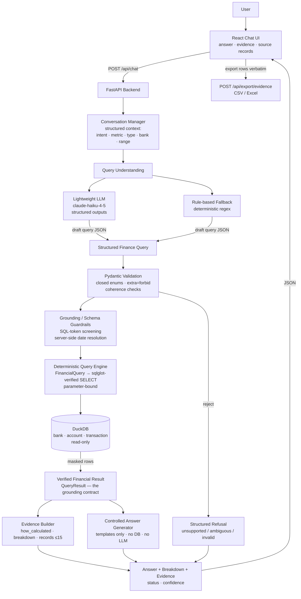
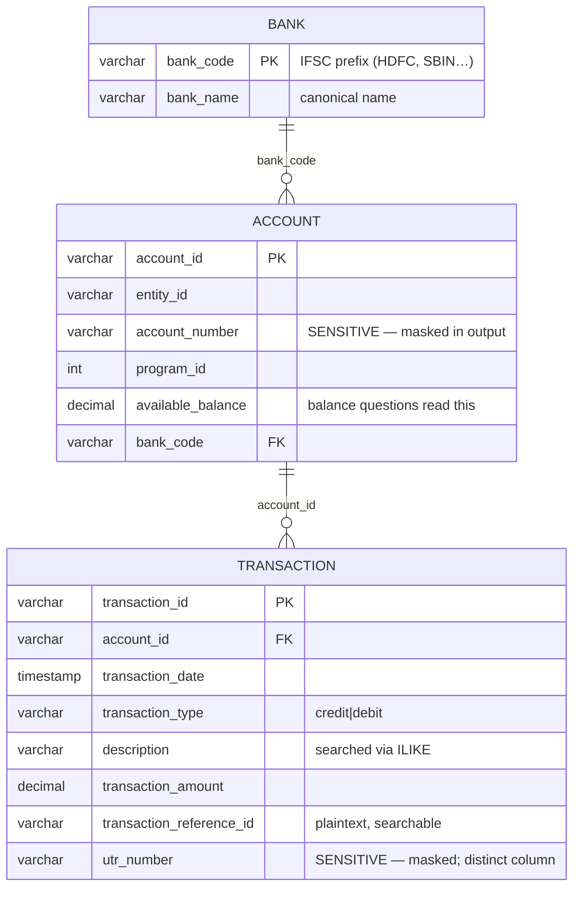

# Artha — System Architecture

> This document describes the architecture **as it actually exists** in the
> repository (post hardening pass). Future/possible components are confined
> to §13 and are explicitly labelled.

## 1. Overview

Artha is a finance Q&A assistant over the TBX dataset (`bank` → `account` →
`transaction`). A user asks questions in natural language through a React
chat UI; a lightweight LLM (or a deterministic rule-based fallback) maps the
question to a **structured Finance Query**; that query is validated, compiled
to a parameterized SELECT, executed against DuckDB, and the computed result
is rendered into an answer by deterministic templates alongside a verifiable
evidence block ("How I got this" + masked source records).

Core principle, enforced structurally (not by prompt discipline):

> **AI understands the question; deterministic systems establish financial
> truth.**

The LLM has no database access, no SQL output path, and no numeric output
path — every rupee figure in an answer was returned by SQL first.

## 2. Architecture diagram



## 3. Request lifecycle

Example request: **"How much did we spend on vendor payouts last month?"**

1. The UI `POST`s `{question, conversation_id}` to `/api/chat`.
2. The conversation manager fetches the **structured context** for that id
   (last intent/metric/type/bank/date-range/filters — never a transcript).
3. The active provider (LLM or rule-based) reads the question + context and
   returns a *draft* structured query. Here it recognizes `vendor` as an
   **unsupported domain** and returns a refusal — no database call is made.
4. (For a supported question:) Pydantic validates the draft — closed enums,
   `extra="forbid"`, coherence rules. Invalid drafts → `invalid` refusal.
5. Guardrails resolve dates server-side ("last month" → absolute range on
   the IST clock) and screen filter values for SQL tokens.
6. The deterministic engine compiles the validated query to a single
   parameterized SELECT (sqlglot-verified), executes it in **read-only**
   DuckDB, and computes the matched-record count pre-limit.
7. DuckDB returns rows; the engine masks `account_number`/`utr_number` at
   the boundary and builds the typed `QueryResult`.
8. Aggregates/peaks/comparisons are computed in the engine (comparison =
   second execution against the previous calendar month).
9. The evidence builder turns the result into `how_calculated` (date range,
   operation, records matched, filters) + breakdown + ≤15 masked records.
10. `generate_answer()` renders the sentence **from the verified result only**
    (Indian digit grouping) — it has no DB session and no LLM.
11. The API responds with `answer`, `evidence`, `query`, `status`,
    `confidence`; the UI displays the three evidence zones and offers
    verbatim CSV/Excel export.

## 4. Grounding architecture

```text
LLM ──draft JSON──▶ validation ──▶ deterministic SQL ──▶ DuckDB
                                                        │
        answer ◀── templates ◀── QueryResult ◀──────────┘
                                   (verified, masked)
```

Why hallucination is structurally prevented:

- **No SQL from the model** — the "text-to-SQL" compiler consumes only a
  validated `FinancialQuery`; sqlglot asserts a single SELECT with no
  DML/DDL nodes; values are bound parameters.
- **No numbers from the model** — answers render exclusively from
  `QueryResult`; a tamper test proves the result object is the sole numeric
  source (`tests/test_grounding_contract.py`).
- **No invented fields** — `extra="forbid"` on every schema; unknown intents/
  metrics/filters fail validation *before* execution.
- **No invented domains** — payroll, invoices, vendors, taxes, escrow,
  customers, forecasts are refused with the missing domain named.
- **No raw sensitive values** — masking happens inside the engine; raw
  `account_number`/`utr_number` are absent downstream (one-way masks,
  verified by test).
- **Read-only database** — the chat path opens `finance.duckdb` with
  `read_only=True`; no write operations exist anywhere in the API.

## 5. Model architecture

- **Why lightweight:** the model performs one constrained extraction task
  over a closed output space; structured outputs + Pydantic validation make
  scale unnecessary for accuracy (full reasoning in
  `docs/model-evaluation.md`).
- **What it does / does not do:** it maps question → draft query JSON; it
  never computes, retrieves, or restates financial values.
- **Structured output:** the Anthropic provider requests JSON-schema-
  constrained decoding with the *same* enums the validator enforces.
- **Provider abstraction:** `LLMProvider` → `AnthropicProvider` (API) or
  `RuleBasedProvider` (deterministic fallback; zero tokens; full benchmark
  passes without any API key). New providers (local models, mocks) subclass
  and register in `build_provider()`.
- **Evaluation framework:** 33-case benchmark scoring accuracy (computed),
  latency, token usage, and failure categories per provider/model.

## 6. Data architecture

Physical tables in `data/finance.duckdb` (built from `data/*.csv`,
deterministic seed=42; 10 banks, 25 accounts, 8,000 transactions):



There are **no** vendor / invoice / payroll / reconciliation tables in the
current data model; questions requiring them are refused, not approximated.
(The teammate-authored `dataset/extended_v1/` directory contains such tables
for future work — it is **not** loaded by the application.)

Indexes match actual query patterns: `transaction_date`, `account_id`,
`transaction_type`, `transaction_reference_id`, `account(bank_code)`.

## 7. Security / safety boundaries

| Boundary | Mechanism |
|---|---|
| Schema enforcement | Pydantic closed enums + `extra="forbid"` on query, filters, date range |
| Forbidden fields | unknown filter names rejected (allowlist = real columns only) |
| SQL-token screening | filter values matched against SQL-keyword patterns and rejected |
| Injection | parameterized queries only; sqlglot asserts single SELECT, no DML/DDL |
| Sensitive masking | `account_number` → `XXXXX1234`; UTR → prefix+***+suffix (engine boundary) |
| Arbitrary SQL | none — the only SQL producer is the deterministic compiler |
| Write operations | none; DuckDB opened read-only on the chat path |
| Unsupported queries | explicit refusal naming the missing domain + capability registry |
| Result exposure | evidence capped at 15 rows; exports are verbatim-masked |

## 8. Conversation architecture

`ConversationContext` stores **structured state only**: last intent, metric,
transaction type, bank, date range, filters. Follow-ups inherit it:

- **"What about July?"** → month-swap branch: same intent + metric + filters,
  new `calendar_month` range resolved server-side.
- **"Only those above ₹50,000."** → refinement branch: previous intent +
  filters + range, merged with the new threshold (requires a back-reference
  word; a new subject like "which bank…" is *not* treated as refinement).
- **"How does that compare with the month before?"** → comparison branch:
  previous metric/type, previous range, `against=previous_period`.

The model receives this compact context object (~6 fields), never the
transcript. Memory is per-conversation, in-process, bounded (last 20
summaries).

## 9. Evidence architecture

```text
QueryResult (engine; masked)
      ↓ build_evidence()
how_calculated {date_range, operation, records_matched, filters, sql, cache_hit}
breakdown      (grouped rows, if any)
records        (≤15, records_truncated flag)
summary        (value, record_count, …)
      ↓
UI zones: ANSWER · HOW I GOT THIS · SOURCE RECORDS (+ export)
```

Comparisons attach a second evidence block for the previous period (with its
own label), so both sides of a percentage are auditable. The comparison
block reports the *comparison* period's dates, not a repeat of the base
period.

## 10. Failure modes

| Failure | Behaviour |
|---|---|
| Unsupported question | structured refusal (`unsupported`), capability list, no execution |
| Ambiguous question | `ambiguous` refusal with clarifying suggestions (e.g. subjectless "how much moved") |
| Invalid model output / failed validation | `invalid` refusal — nothing executes |
| Missing data (valid query, 0 rows) | `empty_data` status, "no records" answer — a real zero, never invented |
| Database errors | `/api/health` degrades; chat raises a 500 with generic detail; engine connections always closed |
| Model/API failure | provider catches and returns a safe "service unavailable" refusal; rule-based fallback keeps the demo alive |
| Cache poisoning | cache stores deep snapshots; callers cannot corrupt cached results (tested) |

## 11. Scalability

For up to ~20M rows the design keeps all heavy work in the database:

- **Aggregation at DB level** — SUM/COUNT/AVG/MIN/MAX, GROUP BY, ORDER BY,
  LIMIT are all in the compiled SQL; Python receives only result rows.
- **Deterministic SQL, fixed shape** — a small family of parameterized
  SELECTs lets DuckDB plan them with the pattern indexes above.
- **Result limits everywhere** — lists cap at `limit` (≤100); evidence caps
  at 15 rows; the matched count is computed with a COUNT, never by fetching.
- **Caching** — identical validated queries reuse cached results (TTL 300s,
  memory or Redis) instead of re-scanning.
- **Masking is O(shown)** — applied to the rows actually returned, not the
  table.

No performance numbers are claimed here — they have not been measured on
20M-row data. The structural point (no record scans in Python) is what the
architecture guarantees.

## 12. Current limitations

Intentionally **not** implemented:

- Real banking integrations / live TBX APIs (read-only file dataset).
- Production authentication, multi-tenancy, per-user authorization.
- The Financial Twin domain (vendors, invoices, mandates, approvals, …) —
  questions about them are refused, and `dataset/extended_v1/` is not wired
  into the app.
- Write operations of any kind (payments, approvals).
- Arbitrary free-form financial analysis beyond the supported intents.
- Multi-worker conversation memory (in-process store; interface ready for
  Redis/DB backends).
- Measured 20M-row performance benchmarks.

## 13. Future architecture (NOT current functionality)

Everything below is a **future extension** — none of it exists in this
repository today:

- **Financial Twin** — the extended dataset's vendor / invoice / payout /
  reconciliation tables materialized as additional *clearly-separated*
  read models, with new intents allowlisted only after their data exists.
- **True available-cash engine** — projecting balances from opening
  positions + pending outflows (requires opening-balance data the current
  schema lacks).
- **Cash-flow simulation** — deterministic scenario runs over the twin.
- **Anomaly detection** — deterministic statistical callouts (e.g. payout
  vs vendor history) surfaced in evidence; the LLM would only explain them.
- **Action planner / approval workflow** — human-in-the-loop write flows
  behind real auth; the assistant stays read-only.
- **Simulated TBX APIs** — mock adapters behind the same read-only boundary.

The seam for all of this is the same: new data → new validated intents →
same deterministic engine → same evidence contract.
