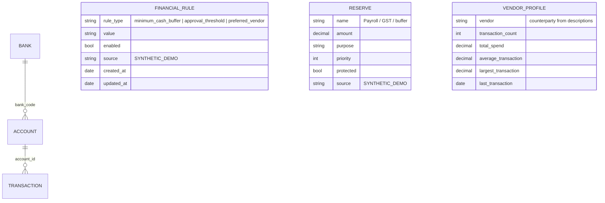

# Financial Twin — Domain Model & Engines

> First Financial-Twin layer (deterministic only). The twin is a structured
> domain model of the business's finances — **not** an LLM. The LLM only
> routes questions to these engines; every number below is computed from
> data or read from clearly-labelled configuration.

---

## 1. Domain model



### Provenance levels (first-class on every value)

| Level | Meaning | Examples |
|---|---|---|
| `OFFICIAL_DATASET` | Read from loaded data | balances, transactions |
| `DERIVED` | Computed deterministically from official rows | vendor profiles, cash position, anomalies |
| `USER_PREFERENCE` | Configured by a user | (reserved — none in demo config yet) |
| `SYNTHETIC_DEMO` | Demo values, clearly labelled | rules, reserves |

The UI renders provenance badges (e.g. `DERIVED`, `DEMO`) next to twin data
so a judge can always tell a dataset fact from configuration.

## 2. Account intelligence

`FinancialTwinEngine.accounts_overview()` reads
`account.available_balance` **directly** — never reconstructed by summing
transactions (a test asserts the two are genuinely different quantities in
the seed). Status/purpose fields don't exist in the current schema and are
not invented; the overview reports what exists with provenance.

## 3. Rules & reserves (SYNTHETIC_DEMO)

Shipped demo configuration (`app/services/financial_twin.py`):

| Item | Value | Source |
|---|---|---|
| `minimum_cash_buffer` | ₹5,00,000 | SYNTHETIC_DEMO |
| `approval_threshold` | ₹2,00,000 | SYNTHETIC_DEMO |
| Payroll reserve | ₹6,00,000 (protected) | SYNTHETIC_DEMO |
| GST reserve | ₹1,50,000 (protected) | SYNTHETIC_DEMO |

Each rule carries `rule_type, value, enabled, source, created_at,
updated_at`; each reserve carries `name, amount, purpose, priority,
protected, source`. Nothing here pretends to come from the dataset.

## 4. Vendor / counterparty intelligence (DERIVED)

Counterparties are extracted from transaction descriptions with
deterministic format parsers (`app/services/vendor_intel.py` — UPI/NEFT/
IMPS/FT channel formats). Per-vendor aggregates (`transaction_count`,
`total_spend` debit-only, `average_transaction`, `largest_transaction`,
`last_transaction`) are computed from actual rows; a test re-computes one
vendor's total via direct SQL and compares. `unreconciled_count` is omitted
because the dataset has no reconciliation records (see §7).

## 5. True available-cash engine

```
true_available_cash = available_balance (OFFICIAL_DATASET)
                    − restricted_amount (no dataset source → 0, never invented)
                    − protected_reserves (SYNTHETIC_DEMO)
                    − upcoming_commitments (no dataset source → 0)
```

- **No double counting**: reserves are subtracted exactly once, from
  balances; balances are read from the authoritative field. A test asserts
  the arithmetic identity on the live engine.
- Missing components are reported as explicit zeros with a note — not
  guessed. Every component carries its own provenance in the response.
- API: `GET /api/twin/cash-position`; chat: *"How much cash do I really
  have?"*, *"Why is my available cash lower than my total balance?"*

## 6. Affordability & what-if simulation

`can_i_afford(vendor, amount)` — deterministic feasibility:

1. cash position (above)
2. `cash_after = true_available_cash − amount`
3. **reserve violation** if the payment eats into protected reserves
4. **buffer violation** if `cash_after < minimum_cash_buffer`
5. **approval required** if `amount > approval_threshold`
6. vendor history (derived) attached as context
7. structured result + human-readable reasons + provenance per component

`simulate_payment(vendor, amount)` — static before → payment → after with
per-rule outcomes (✓ preserved / ⚠ violated / approval). Explicitly labelled
assumptions (static, no future flows, demo rules). **No payment is ever
executed** — a test proves balances are unchanged after analysis, and no
pay endpoint exists.

## 7. Reconciliation adapter (honest absence)

The current dataset has **no reconciliation table**.
`reconciliation_status()` returns `available: false` plus the exact adapter
interface (`expected_table`, `expected_columns`) the extended dataset
(`dataset/extended_v1/csv/reconciliation_case.csv` etc.) can satisfy later.
No reconciliation numbers are fabricated anywhere.

## 8. Anomaly detection (DERIVED)

Deterministic rule, no ML, no LLM judgement:

> a transaction is anomalous when `amount > multiplier × counterparty
> historical_average` (history excludes the transaction itself; at least
> `min_history` records required — otherwise never flagged).

Configurable via `ARTHA_ANOMALY_MULTIPLIER` (default 3.0) and
`ARTHA_ANOMALY_MIN_HISTORY` (default 5). Zero-average and unknown
counterparty cases are explicitly non-anomalous. API: `GET
/api/twin/anomalies`; chat: *"Any unusual transactions?"*. Tests cover
normal / anomalous / insufficient-history / zero / determinism.

## 9. Chat integration

Twin scenarios route **before** the unsupported-domain gate (so "Can I pay
Sharma Suppliers…" isn't refused for saying "pay"). The provider emits a
scenario descriptor (`{"scenario": "affordability", "vendor": …, "amount":
…}`); `ChatService._handle_scenario` executes the deterministic engine and
renders template answers from the verified result. Same grounding contract
as the query path — the LLM produces only the descriptor, never numbers.

## 10. Current limitations

- Rules/reserves are demo configuration; there is no persistence layer or
  CRUD API for them yet (deliberately — user-authored rules need auth).
- Reconciliation intelligence awaits the extended dataset; the adapter
  interface is defined but `not_loaded`.
- Restricted funds and upcoming commitments have no data source; the cash
  engine reports them as zero rather than estimating.
- Vendor extraction depends on the dataset's description formats; unknown
  formats yield no counterparty rather than a wrong one.
- The what-if simulation is static (no scheduled inflows/outflows).
- No numeric confidence — confidence remains categorical by design.
